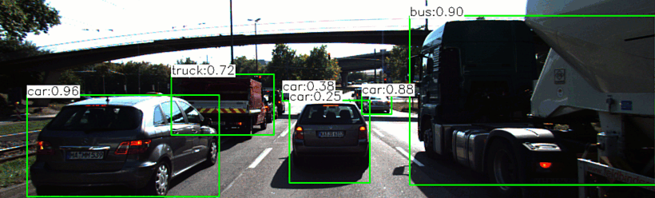
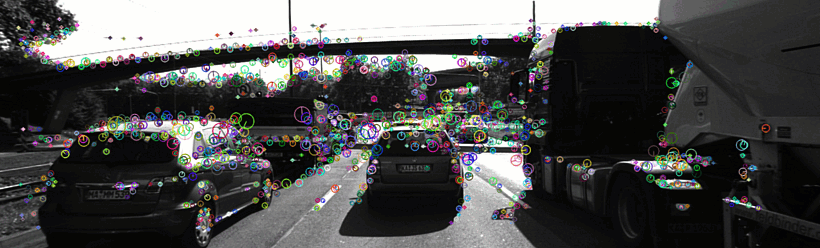
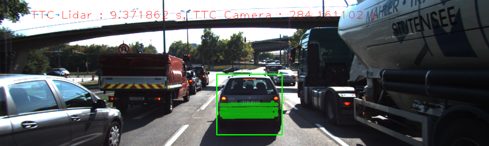
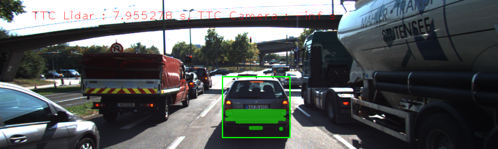
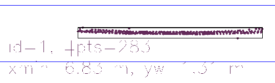
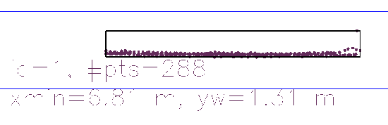
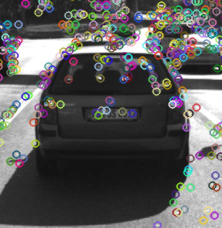
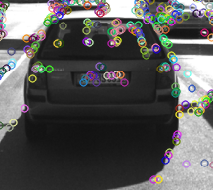
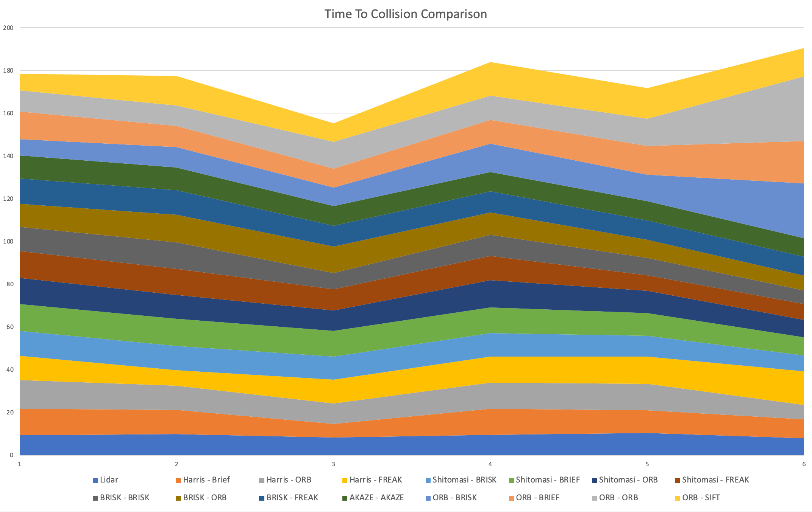

# 3D Object Tracking

This final project for Udacity's Sensor Fusion Camera course demonstrates various methods to track a 3D object using keypoint detection and feature matching, lidar point cloud data, and camera imagery for classification using the YOLO deep learning model. Estimation of the time to collision is calulated using the constant velocity model.

## Dependencies for Running Locally

The following dependencies are required to run the program locally.
* cmake >= 3.17
  * All OSes: [click here for installation instructions](https://cmake.org/install/)
* make >= 4.3 (Linux, Mac)
  * Linux: make is installed by default on most Linux distros
  * Mac: [install Xcode command line tools to get make](https://developer.apple.com/xcode/features/)
* OpenCV >= 4.5
  * The OpenCV 4.5 source code can be found [here](https://github.com/opencv/opencv/tree/4.1.0)
* gcc/g++ >= 5.4
  * Linux: gcc / g++ is installed by default on most Linux distros
  * Mac: same deal as make - [install Xcode command line tools](https://developer.apple.com/xcode/features/)
* Git LFS
  * Weight files are handled using [LFS](https://git-lfs.github.com/)
* NOTE: This project is tested using Mac OSX 10.15

## Basic Build Instructions

1. Clone this repo.
2. Make a build directory in the top level project directory: `mkdir build && cd build`
3. Compile: `cmake .. && make`
4. Run it: `./3D_object_tracking`.

## Rubric Items Addressed
* FP_1: Addressed in line 290 of camFusion_Student.cpp, this function loops over all descriptor matches and select only keypoints if frames that match. For each bounding box in the previous frame, see if the region of interest contains that keypoint associated with the current frame. Record the most frequent associated box IDs for the previous frame and store them in an unorderd map. Return the box ID that has the most occurance of keypoitns within the region of interest.
* FP_2: Addressed in line 244 of camFusion_Student.cpp. In order to eliminate outliers each vector of Lidar Points is filtered. First the mean and standard deviation are calculated for the set of points in the previous and current frame. Lidar points that are outside + or - one standard deviation of the mean are filtered out.
* FP_3: Addressed in line 146 of camFusion_Student.cpp. For each keypoint match the euclidean distance between keypoint each keypoint match is calculated. In another loop each keypoint match is associated with a keypoint in both the current and previous frames. If the region of interest contains the keypoint and the distance between keypoint matches is below a threshold, then add the keypoint match to the bounding box structure.
* FP_4: Addressed in line 171 of camFusion_Student.cpp. This function uses the distance ratios between keypoints in successive  frames to calculate the TTC. 
* FP_5: 
  * Example 1 - Using HARRIS keypoint detector and BRIEF descriptor yields surprisingly terrible results for TTC camera calcuation. The estimation fluctuation is large between 300 seconds to infinity. I imagine this is due to the calculation of the mean distance ration between keypoints in successive frames. In the images directly infront of the ego vehicle, you can see that the lidar points shift down. This is seen in the next few images but from the top view. You can see that the bounding box of such lidar points is shifted and larger indicating there are more outliers. I suspect this has a lot to do with the calculation of the time to collision.
  
  
  
  
  * Example 2 - FAST and ORB detector and descriptor do not yield results. Descriptors are extracted but there are none added to the bounding box. I would imagine this is because the ORB detector is not robust enough to handle the noise in the images. I also suspect that the descriptor matching is not as accurate using this method. In the folowing images notice the keypoints are not exactly matching in the previous and current frame. While you can expect some shifting from one from the other, the shift is not consistent. It is evident in the brute force matching method that the keypoints are not exactly matching. In fact when using BF matcher with cross-check there are no matches at all. This is why the TTC calculation does not update from frame to frame.

  
  
* FP_6:
  * Example 1 - Using ORB/ORB combination yields results that are considerably better than the other methods, however the results are not consistent in the calculation of the TTC with the camera. I imagine this is due to the fact that calculation using the distance ration between keypoints is not robust enough to handle variation in keypoint locations. 
  * Example 2 - Using the SIFT/SIFT combination yields results for the TTC camera estimation that are within a second of the TTC with lidar. However, it only works for a few frames then the results do not update. I suspect this is because there are not enough keypoints to calculate the distance ratio between keypoints.

  When comparing the TTC estimate of Lidar and all combinations of keypoint detectors and descriptors, there is a trend that is followed. The Lidar measurement is fairly consistant in teh fact that it does eventually converge. However, when looking at the other combinations, the results are quite different. Notice that most combinations TTC estimate decrease in the first few frames then increase, then everntually decrease again. The Shitomasi, BRISK and AKAZE combinations seem to all decrease towards the last frames while the others actually increase. I image this is due to the robustness of the keypoint descriptor extractors. While the binary extractor combinations may be faster, they are not as accurate which is evident in the increase in TTC estimate.

  